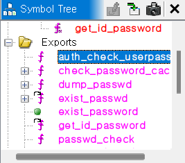

# ipTIME N702E Firmware Analysis

본 프로젝트는 ipTIME N702E 공유기 펌웨어 내 웹 서버(`httpd`) 바이너리를 정적 분석하여, 공유기의 로그인 인증 방식을 기록한 것입니다.

## 1. 프로젝트 개요
- 분석 대상: ipTIME N702E 펌웨어 (버전: 12.102)
- 분석 목표: 공유기 웹 서버의 인증 로직 역추적 및 보안 메커니즘 분석
- 사용 도구: Ghidra

## 2. 분석 환경 및 구성
- firmware/: 분석 대상이 된 펌웨어 원본 바이너리
- analysis-docs/: 분석 과정에서 도출한 호출 관계 사진

## 3. 핵심 분석 내용

### 3.1 핵심 인증 함수 식별
펌웨어를 Ghidra로 분석한 결과, `Symbol Tree` 내 `Exports` 항목에서 인증 로직을 담당하는 핵심 함수들을 직접 식별하였습니다. 단순 문자열 탐색보다 정확하게 핵심 함수들을 찾아낼 수 있었습니다.



### 3.2 핵심 함수 분석
식별된 `auth_check_userpass`와 `check_password_cache` 함수가 펌웨어 전체 동작에서 어떤 동작을 하는지 확인했습니다.
Ghidra로 compile한 결과입니다.

```c
bool auth_check_userpass(void)
{
  int iVar1;
  undefined4 in_a3;
  
  // 패스워드 캐시 확인 및 자격 증명 검증
  iVar1 = check_password_cache(); 
  
  // 검증 실패 시 시스템 로그 기록
  if (iVar1 != 0) {
    syslog_msg(1, "{17}", in_a3);
  }
  
  // 인증 결과 반환 (성공/실패 분기)
  return iVar1 != 0;
}
```

분석 결과 해당 함수는 단순히 비밀번호를 비교하는 로직을 넘어 인증 실패 시 syslog_msg를 호출하여 시스템에 기록을 남기는 동작을합니다.

### 3.3 인증 메커니즘 심층 분석
`auth_authorize`함수를 통해 웹 서버가 클라이언트의 인증 요청을 처리하는 상세 과정을 분석했습니다.
```c
 // HTTP 헤더의 'Authorization' 값이 'Basic '으로 시작하는지 확인
  iVar2 = strncasecmp(pcVar4, "Basic ", 6);
  if (iVar2 == 0) {
    // Base64로 인코딩된 인증 정보 디코딩
    base64decode2(&DAT_004296ec, pcVar4 + 6, 0x100);
    
    // 디코딩된 문자열에서 아이디와 비밀번호를 구분하는 ':' (0x3a) 위치 탐색
    pcVar4 = strchr(&DAT_004296ec, 0x3a);
    if (pcVar4 != (char *)0x0) {
      *pcVar4 = '\0'; // ':'를 널 문자로 치환하여 문자열 분리
      
      // 분리된 ID와 PW를 통해 최종 인증 수행
      iVar2 = auth_check_userpass(&DAT_004296ec, pcVar4 + 1, puVar3, param_1 + 0x464);
      
      if (iVar2 == 0) return 1; // 인증 성공 시 정상 처리
      goto LAB_00410454;        // 인증 실패 시 401 Unauthorized 호출
    }
  }
```
[분석 포인트]
- 인증 파싱: strncasecmp로 Basic 스키마를 검증한 뒤, Base64 데이터를 디코딩

- 문자열 처리: strchr로 :(0x3a) 위치를 찾아 Null terminator(\0)를 삽입 후 아이디와 비밀번호를 개별 문자열로 즉석 분리

- 인증 분기: 검증 성공 시 요청을 승인하고, 실패 시 send_r_unauthorized를 호출하여 401 Unauthorized를 반환

## 4. 느낀점
이번 분석을 통해 ipTIME 공유기가 `HTTP Basic Authentication`을 어떻게 구현하고 있는지 전체적인 흐름을 파악했습니다. 
평소에 연습문제만 풀다가 펌웨어내 핵심 바이너리를 찾아서 분석해보니 구조가 생각보다 취약하다고 생각했습니다.

## 5. 향후 계획
- 파악된 인증 로직을 바탕으로 공격 방법 검토.
